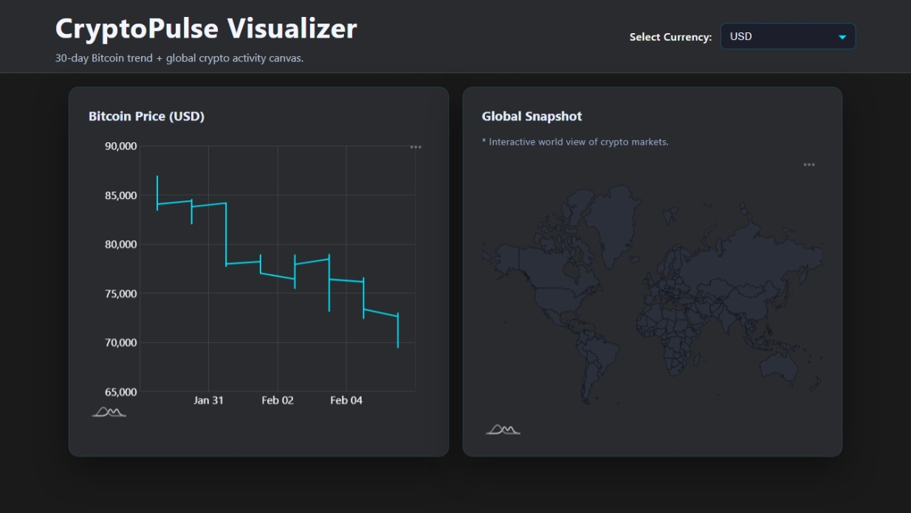

 # CryptoPulse Visualizer

An interactive dashboard built with React and amCharts 5 that showcases real-time Bitcoin market data alongside a global crypto presence snapshot. Designed as a portfolio-ready project to demonstrate data visualization, responsive UI, and polished UX for both desktop and mobile screens.



**Live Demo:** https://crypto-pulse-visualizer-1spq-d4i76ztdy-rizqs-projects-46fdbc99.vercel.app/

## Features

- **Live Bitcoin price line chart** powered by the CoinGecko API with currency switching (USD, EUR, EGP, GBP, and the rest of the API-supported list).
- **Export-ready visuals** using amCharts’ exporting plugin (PNG, JPG, SVG, PDF, XLSX).
- **Animated world map** highlighting the global reach of crypto markets via amCharts geodata.
- **Dark-mode dashboard** with responsive grid layout and touch-friendly controls.
- **Custom tooltips & loading states** for a polished, professional experience.

## Tech Stack

- React 19 (Create React App)
- amCharts 5 (XY + Map + Exporting plugins)
- CoinGecko public API
- Modern CSS (flex/grid layouts, custom controls)

## Getting Started

```bash
# install dependencies
npm install

# start dev server
npm start

# build for production
npm run build
```

Open http://localhost:3000 to explore the dashboard. The page will reload if you make edits.

## Configuration

| Area | Description |
| --- | --- |
| `src/App.js` | Main dashboard logic: currency dropdown, BTC chart, loading state |
| `src/components/CryptoMap.js` | Encapsulated map component with exporting toggle |
| `src/App.css` | Theme, grid layout, card styling, dropdown polish |
| `docs/media/Screenshot.jpeg` | Marketing preview used in this README |

## Roadmap Ideas

- Add historical range selector (7/30/90 days).
- Display additional metrics (volume, dominance) beneath the line chart.
- Highlight regions on the map based on live market sentiment.
- Package the dashboard as a deployable static build (Vercel/Netlify).

## Contributing

1. Fork the repo
2. Create a feature branch (`git checkout -b feature/amazing`)
3. Commit your changes (`git commit -m 'Add amazing feature'`)
4. Push to the branch (`git push origin feature/amazing`)
5. Open a Pull Request

## License

This project is open-sourced for portfolio/demo purposes. Adapt it freely but please provide attribution when showcasing derived work.